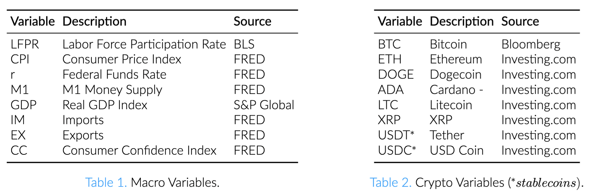
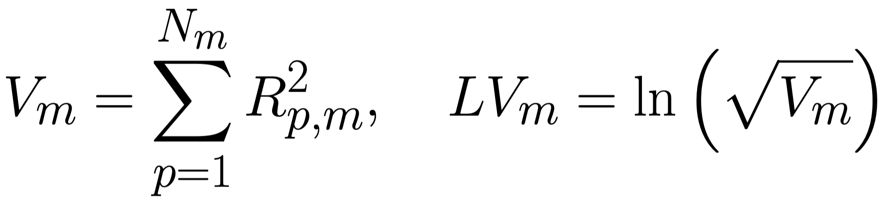
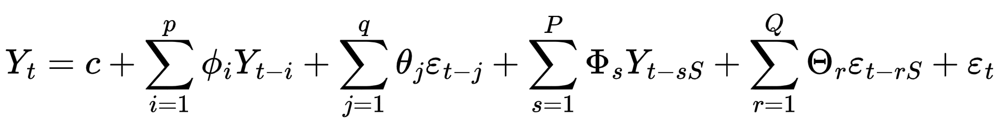
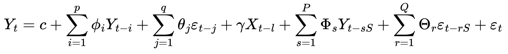
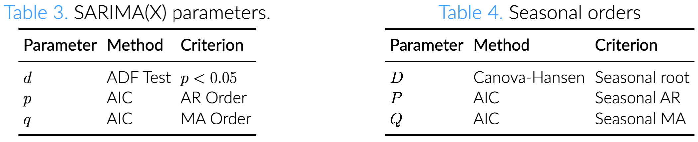
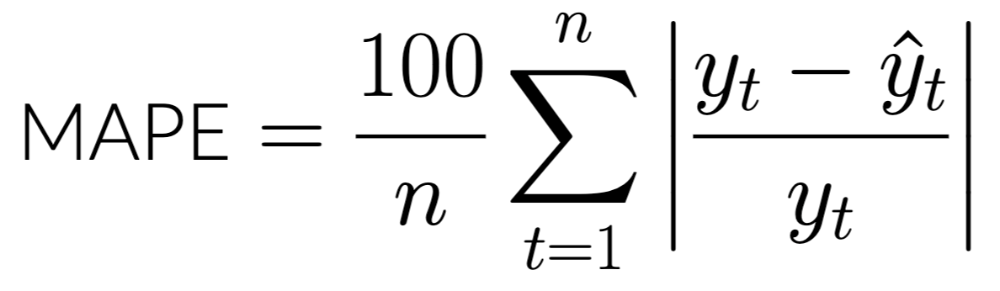
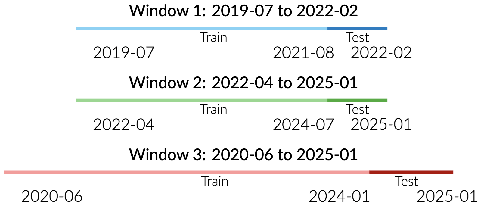
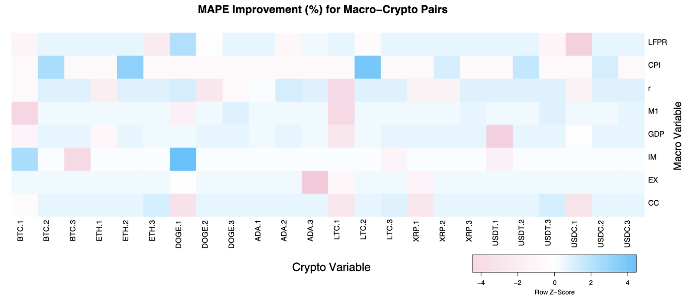
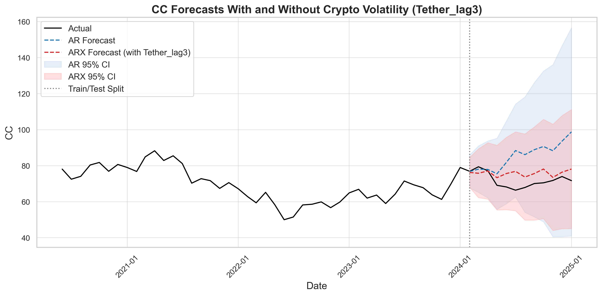
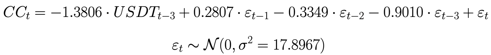

# Forecasting US Macroeconomic Indicators Using Cryptocurrency Volatility

## Authors
- **Alice Ye** ([xy2680@barnard.edu](mailto:xy2680@barnard.edu))
- **Annie Wang** ([tw3067@columbia.edu](mailto:tw3067@columbia.edu))
- **Tianyi Shen** ([ts3678@columbia.edu](mailto:ts3678@columbia.edu))

## Introduction

Studies have shown U.S. monetary policy announcements and macroeconomic shocks influence cryptocurrency volatility [1, 2, 3]. However, the reverse effect of crypto volatility on US macroeconomic indicators is largely unexplored.

## Research Question

To what extent volatility in major cryptocurrencies, including stablecoins and non-stablecoins, can help improve forecasts of key U.S. macroeconomic indicators?

## Data Collection and Processing

We collected data and computed monthly volatility for 8 macroeconomic variables and log-
transformed monthly volatility for 8 cryptocurrencies between 2017-09 and 2025-01.

To prepare the data, we computed log volatility of cryptocurrencies:

  

## Methodology
#### SARIMAX
To assess the predictive power of cryptocurrency, we compared two models:
- **Baseline SARIMA**: no exogenous variables:

- **SARIMAX**: use lagged cryptocurrency volatility as exogenous regressors:

We followed these steps:
1. **Order Selection.**

The seasonal period S is set to S = 3 month (quarterly marker).
2. **Model Fitting.** We generated 0–6 month lags for each crypto asset, selected
variables with p-value < 0.05, and ranked them by MAPE improvement.
3. **Model Evaluation.** We evaluated model performance using p-values and MAPE
(Mean Absolute Percentage Error):

  

#### Window Classification
Based on the volatility of our macroeconomic variables, we defined 3 windows to capture periods of high volatility [including the COVID shock], low volatility [without significant shock], and a more holistic, medium volatility period.

## Results & Discussion
#### MAPE Improvement
Combining all significant MAPE percentage changes across the three windows, we found improvement ranging from 2% to 93%, with an average improvement of 32%. Since MAPE measures the average prediction error as a percentage of actual values, larger MAPE percentage improvement indicated better model forecast accuracy in forecasting macroeconomic indicators when crypto is considered.

*Figure 1: SARIMAX vs. SARIMA MAPE improvement(%) for macro-crypto pairs, windows 1-3 using
heatmapper [4]*

#### Across Windows
For each of the windows 1-3, we found that only certain cryptocurrencies helped improve the forecast of different macroeconomic indicators.
- In **Window 1** (high volatility), incorporating Dogecoin volatility with a two-month lag improved predictions for LFPR, r, and IM, with MAPE reductions of 69.65%, 45.63%, and 65.48%, respectively. 
- In **Window 2** (low volatility), LTC, ETH, BTC, USDT, USDC, and XRP reduced forecast error for CPI. Cardano at a three-month lag yielded the greatest improvement in this window, reducing the MAPE for r forecasting by 19.91%.
- In **Window 3** (moderate volatility), forecasts of the M1 money supply benefited the most from incorporating cryptocurrency volatility, with Dogecoin at a two-month lag reducing the MAPE by a substantial 93.39%.

#### Sample Forecast: CC With Tether

*Figure 2: Consumer confidence index forecasts for window 3 with and without Tether volatility (3 months lag)*

  

For Window 3, Tether, with a 3 month lag, proved significant in forecasting Consumer Confidence (p-value=0.01). Including Tether in the SARIMAX model improved the MAPE by 65.8% when compared to the benchmark SARIMA model. For every unit change in Tether log volatility, the forecast for CC volatility decreased by 1.38. This suggested that Tether, along with Ethereum and Litecoin, exhibited forecasting ability for Consumer Confidence during a moderately volatile period.

## Conclusion

Our analysis revealed that cryptocurrencies can be used for forecasting macroeco-
nomic variables across periods of different macroeconomic volatility. Notably:
- Dogecoin was a consistent predictor across all three time windows, suggesting that investor sentiment may be more closely linked to the broader economy than previously understood.
- In the low volatility regime, 6 crypto assets improved inflation rate (CPI) prediction suggesting that during calm market phases, inflation may become more closely aligned with crypto dynamics.
While specific cryptocurrencies’ predictive power proved to be conditional on the
market regime, our model’s performance suggests a potentially larger role in hybrid
forecasting models that combine traditional assets with cryptocurrency. Future ex-
plorations could include non-linear models and also global macroeconomic indicators.

## References

## References

1. Al-Khazali, O., Bouri, E., & Roubaud, D. (2018). *The impact of positive and negative macroeconomic news surprises: Gold versus Bitcoin*. Economics Bulletin, 38(1).

2. Tzeng, K.-Y., & Su, Y.-K. (2024). *Can U.S. macroeconomic indicators forecast cryptocurrency volatility?* The North American Journal of Economics and Finance, 74, 102224.

3. Conrad, C., Custovic, A., & Ghysels, E. (2018). *Long- and short-term cryptocurrency volatility components: A GARCH-MIDAS analysis*. SSRN Electronic Journal, 11(2).

4. Babicki, S., Arndt, D., Marcu, A., Liang, Y., Grant, J. R., Maciejewski, A., & Wishart, D. S. (2016). *Heatmapper: web-enabled heat mapping for all*. Nucleic Acids Research.

## Acknowledgements

This research was conducted as part of the Columbia Summer Undergraduate Research Experiences in Mathematical Modeling (CSUREMM). We are grateful to our advisors George Dragomir, Vihan Pandey, and Dobrin Marchev for their mentorship and support.
